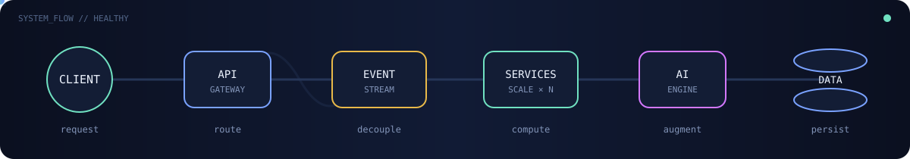

# Hi, I'm Soutik 👋

### Software Engineer · System Design · Scalable Platforms · AI Integrations

I design and build dependable software with a focus on **scalable systems, thoughtful architecture, and real-world impact**. I enjoy going deep on hard problems—understanding the trade-offs, finding the simplest robust solution, and turning ideas into systems that can grow.

  

  

Keep the request alive. Jump over latency spikes. Collect AI boosts. How far can your system scale?

## 👨‍💻 About me

- Designing backend and distributed systems for **payments, ledgers, and fintech**
- Deeply interested in **system design, scalable platforms, event-driven architecture, and stream processing**
- Exploring **AI integrations** that make products and engineering workflows more intelligent
- Solving algorithmic problems with an emphasis on fundamentals, trade-offs, and clear reasoning
- Thinking beyond code: reliability, failure modes, observability, maintainability, and the humans operating the system
- Building with **Java, Go, Python, and JavaScript**

## 🧰 Skills

| Area | Technologies |
|---|---|
| **Languages** | Java · Go · Python · JavaScript · Bash |
| **Backend** | Spring Boot · Microservices · JDBC · Camunda · JUnit |
| **Infrastructure** | Kubernetes · Docker · AWS · Helm |
| **Architecture** | Event-Driven Architecture · Apache Flink · Distributed Systems |
| **Databases** | PostgreSQL · SQL · Query Optimization |
| **Observability** | Prometheus · Grafana · Kibana |
| **AI-assisted development** | Cursor · GitHub Copilot · Claude |
| **Domain knowledge** | Payments · Ledger Systems · Fintech |

  
  
  
  
  
  
  
  
  
  

## 🏆 Competitive programming

  
  
  

The badges link directly to my profiles—follow along as I work through algorithms, contests, and problem-solving challenges.

## 🚀 Featured projects

### [Log Insights CLI](https://github.com/braindroid/java-log-insights)

A dependency-free Java CLI that parses application logs, filters by severity or keyword, generates useful statistics, and exports results to CSV.

`Java 17` · `CLI Design` · `File Processing` · `Testing`

### [Algorithm Visualizer](https://github.com/braindroid/algorithm-visualizer)

An interactive visualizer for sorting and searching algorithms with adjustable speed, live operation counters, and pause/resume controls.

`JavaScript` · `Async Generators` · `Algorithms` · `Responsive UI`

### [Eat & Split](https://github.com/braindroid/eat-n-split-bill)

A practical web application for tracking shared expenses and calculating balances between friends.

`JavaScript` · `React` · `State Management` · `UI Development`

## 📊 GitHub activity

  
  

  

---

  <strong>Interested in collaborating on backend, distributed-systems, fintech, Java, or Go projects.</strong>

